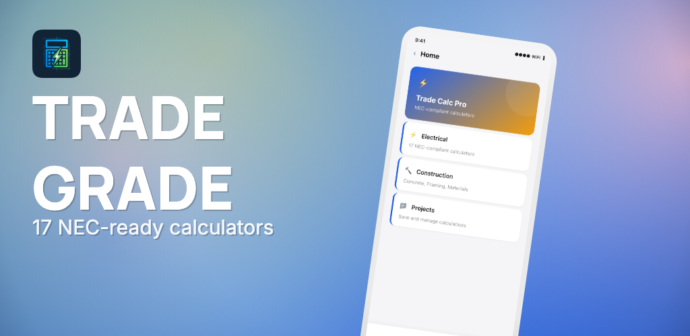
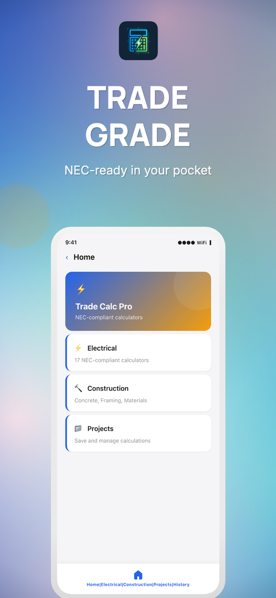
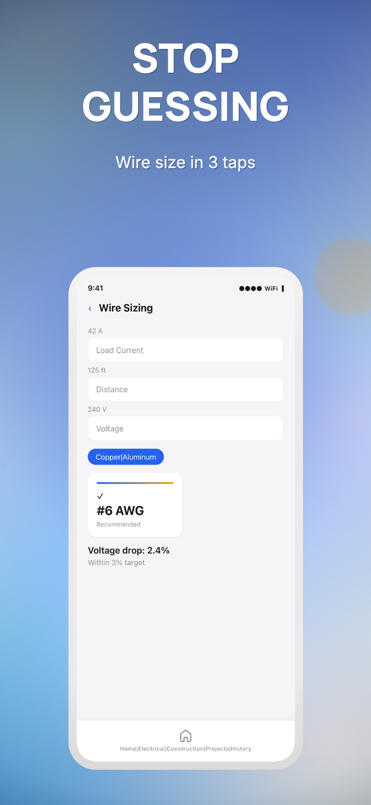
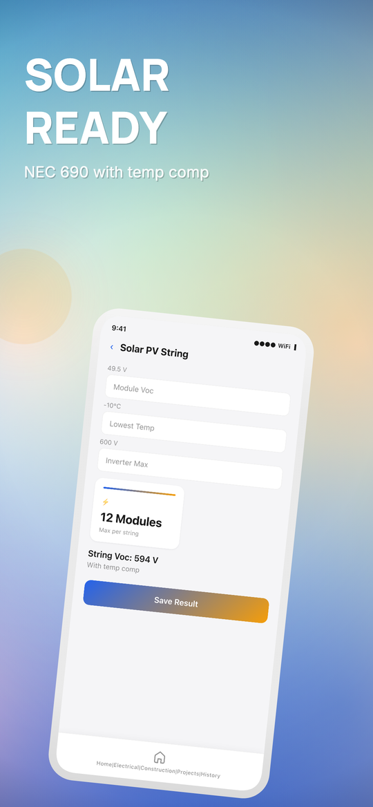
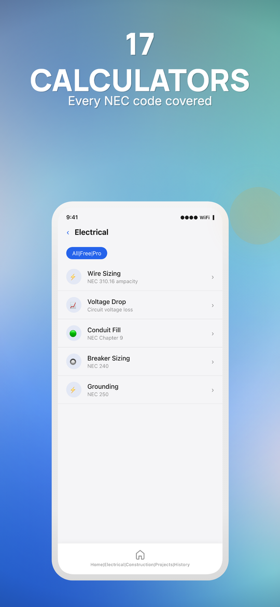
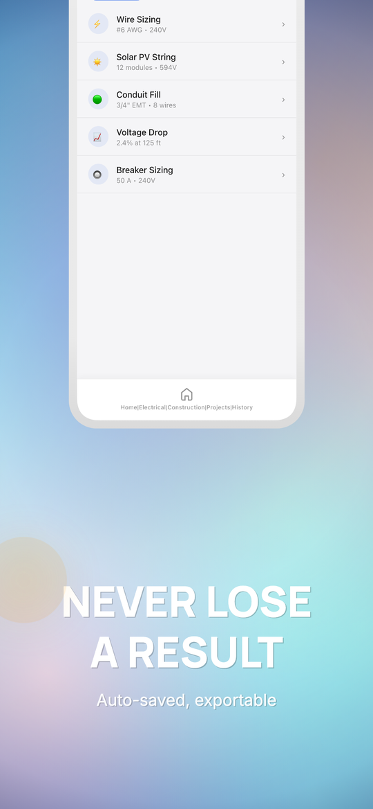
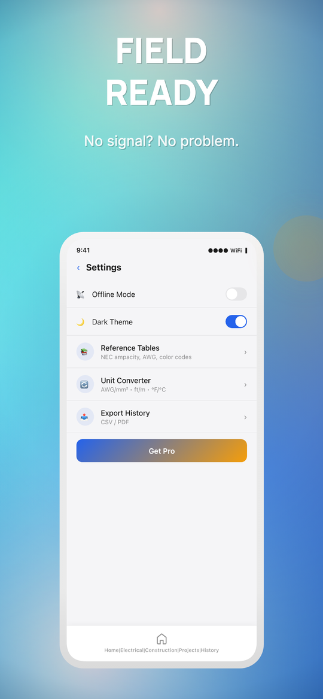

# snap-mock-skill

Generate Google Play Store mockup screenshots **and** the 1024×500 Feature Graphic from any local project directory — without leaving the terminal.

A self-contained [Claude Code](https://claude.ai/code) plugin. Point at a local codebase, get 7 ready-to-upload PNGs (6 slot screenshots + 1 Feature Graphic). The plugin ships its own Next.js + Konva renderer; you don't need to clone anything else.

## Preview

These were generated with `snap mock /path/to/TradeCalcPro` — a real React Native app. No prompts written by hand; everything below is derived from the project's source code (real tab labels from the navigator, real calculator names from `HomeScreen.tsx`, brand colors extracted from theme files).

### Feature Graphic (1024×500)



### 6 slot screenshots (1080×1920 each)

| Hero | Wire Sizing | Solar PV |
|:---:|:---:|:---:|
|  |  |  |
| **Calculator Library** | **Saved Calculations** | **Works Offline** |
|  |  |  |

The 6 slots follow a deliberate narrative arc (Hook → Problem → Core feature → Breadth → Proof → Trust/CTA), and the Feature Graphic reuses one of the slot's in-device renders so the campaign reads as a single piece.

## Install

```text
/plugin marketplace add arslan8122/snap-mock-skill
/plugin install snap-mock-skill@snap-mock-skill
```

That's it. No second repo to clone, no API keys.

## Use

From any directory, in Claude Code:

> snap mock /path/to/your-project

Other phrasings that trigger the skill:

- `generate mockups for /path/to/your-project`
- `play store screenshots from /path/to/your-project`
- `create app store mockups for <path>`

When done, you'll have:

```text
./mockups/slot-01.png         1080×1920
./mockups/slot-02.png         1080×1920
./mockups/slot-03.png         1080×1920
./mockups/slot-04.png         1080×1920
./mockups/slot-05.png         1080×1920
./mockups/slot-06.png         1080×1920
./mockups/feature-graphic.png 1024×500
```

…ready to upload to Google Play Console.

## How it works

```text
1. scaffold      provision the bundled Next.js + Konva renderer at ~/.snap-mock-renderer
                 (first run only: npm install + chromium download)
2. analyze       walk the target directory, extract app name, framework, brand colors,
                 screen graph, navigator structure, project assets
3. synthesize    Claude reads your source files and writes 6 slot briefs + 1 Feature Graphic
                 brief, with real tab labels, real calculator names, real screen UI
4. render        write briefs.json into the renderer's public/, start next dev in the
                 background
5. export        headless Chromium clicks "Export ZIP", captures the bundle, unpacks it
                 into ./mockups/
```

The dev server tears down automatically when your Claude Code session ends.

## Modes

### Standalone (default)

The plugin ships a minimal Next.js + React + Konva renderer at `templates/renderer/`. On first run, `scaffold.sh` materializes it into `~/.snap-mock-renderer/` and runs `npm install`. Subsequent runs reuse the renderer — no install, no rebuild.

Override the location with `SNAP_MOCK_RENDERER_HOME=/some/other/dir`.

### In-place (auto-detected)

If your current directory (or its `frontend/` subdir) already has `next` + `react` + `konva` in `package.json`, the skill operates **in-place**: it copies its library files into your existing project, prints "ACTION REQUIRED" patches you need to apply to `EditorToolbar.tsx` and `page.tsx`, and uses your dev server.

Force a mode explicitly with `SNAP_MOCK_MODE=standalone` or `SNAP_MOCK_MODE=inplace`.

## Prerequisites

- **Claude Code** with plugin support
- **Node ≥20** + **npm** (the bundled renderer uses Next.js 16)
- **Python 3** (used by the analysis script)
- A target directory to analyze. No `gh`, no GitHub token, no internet access required for analysis.
- ~150 MB free disk for first-run Chromium download (cached at `~/.cache/ms-playwright`).

## Output guarantees

Every run produces exactly:

- **6 screenshots** at 1080×1920 (Google Play portrait), each with a different in-device screen rendered from your real source code, panoramic mesh background that stitches across slot boundaries, and a unique narrative role.
- **1 Feature Graphic** at 1024×500, theme-synced with the slots, with a tilted device showing one of the slot screens via `source_slot`.

No external imagery is fetched or generated — every visual is derived from your project (app icon, in-project illustrations, in-device screen renders).

## Troubleshooting

| Problem | Fix |
|---|---|
| Port 3000 busy | `start-dev.sh` falls through to 3137 automatically. Both busy → `lsof -ti:3000 \| xargs kill`. |
| Chromium download failed | `cd ~/.snap-mock-renderer && npx playwright install chromium` |
| `npm install` failed | `cd ~/.snap-mock-renderer && rm -rf node_modules && npm install` |
| `briefs.json` schema collision (in-place mode) | Skill writes `briefs.claude.json` instead and tells you. |
| Background `next dev` lingering | `lsof -ti:3000 \| xargs kill -9` (the SessionEnd hook usually handles this) |
| Wrong screens detected | The analyzer matches files with `.dart`, `.ts`, `.tsx`, `.js`, `.jsx`, `.kt`, `.java`, `.swift` extensions and a `screen\|page\|view\|activity\|fragment` substring. |

## Limitations (current scope)

- Per-slot regeneration not supported (you re-run the whole pipeline)
- Brand-kit / palette overrides not exposed as flags (auto-extracted from source)
- App Store 1290×2796 sizing not supported (Play Store 1080×1920 only)
- npm only (pnpm/bun lockfiles not detected)

## Contributing

The plugin lives at `/Users/arslan/datics/arslan/snap-mock-skill` in development. To run a local copy without publishing to a marketplace:

```bash
ln -s /path/to/snap-mock-skill ~/.claude/plugins/snap-mock-skill
```

Then in Claude Code: `/plugin install snap-mock-skill@snap-mock-skill`.

PRs welcome — especially for:

- Per-slot regeneration
- App Store 1290×2796 device frames
- Bun / pnpm lockfile detection
- Additional layout archetypes
- Tests covering analyze-local.sh on more frameworks

Report bugs at <https://github.com/arslan8122/snap-mock-skill/issues>.

## License

MIT — see [LICENSE](./LICENSE).
